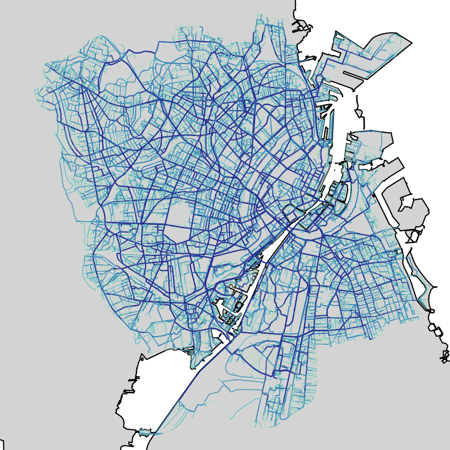

# Hyggebike 🚲

</img>

Exam project for Geospatial Data Science 

By Mads Høgenhaug, Marcus Friis &  Morten Pedersen

## Technical todo list:
- Write README
- Ensure all production notebooks are cool and nice and documented (with cool gif?)
- Create final results from [pathfinder](/notebooks/hyggefinder.ipynb)
  - Individual examples of routes
  - Table of samples, to investigate reroute index
  - Aggregate impact on network
    - Hyggeweight per path
    - Hygge betweenness vs length betweenness
    - Hygge assortativity - are hygge paths connected to other hygge paths?
  - Export relevant geospatial visualizations for birds/trees/noise/highway. For instance, show network for each feature and then the aggregate result.
- If time, update interactive map / make pathfinder tool.

## Project description 

Introducing "Hyggebike": A framework to get the hyggeligste route from point A to point B. Based on various factors such as nearby nature, noise, and amount of traffic, we want to construct a "hygge score" for each road. Then we will find a route that focuses on minimizing the distance while maximizing the "hygge score". For this, we will use OpenStreetMap along with any auxiliary data that we suspect could contribute to a more "hyggelig" route. Optimally, we want to end up with an interactive tool, similar to other map services, but with the custom pathfinder. For map visualizations, we wish to create a map detailing the bicycle network of Copenhagen with visualized "hygge scores", along with individual maps of factors contributing to the score. Extra ideas could be to implement POIs along the route, such as restaurants, toilets, etc. etc. Or generate "hygge routes" based on a list of POIs - the possibilities are endless.

## Data
### Birds
bird_observations.rar: Bird observations, downloaded from https://dofbasen.dk/search/index.php with area set to "DOF København" and years set to 2020 to 2024, afterwards cleaned as to only have observations with exact locations marked.

### Trees
Trees.rar: Municipal trees in Copenhagen municipality. From https://www.opendata.dk/city-of-copenhagen/trae-basis-kommunale-traeer#resource-traer_basis.csv

### Noise
[Stoej.rar](data/raw/stoej.rar): Noise data for Copenhagen municipality only. Downloaded from: [Opendata.dk](https://www.opendata.dk/city-of-copenhagen/vejstoej_2022). The data is displayed at [Copenhagen's Municipality's webiste](https://www.kk.dk/borger/affald-og-miljoe/stoej-stoev-og-luft/trafikstoej). 

