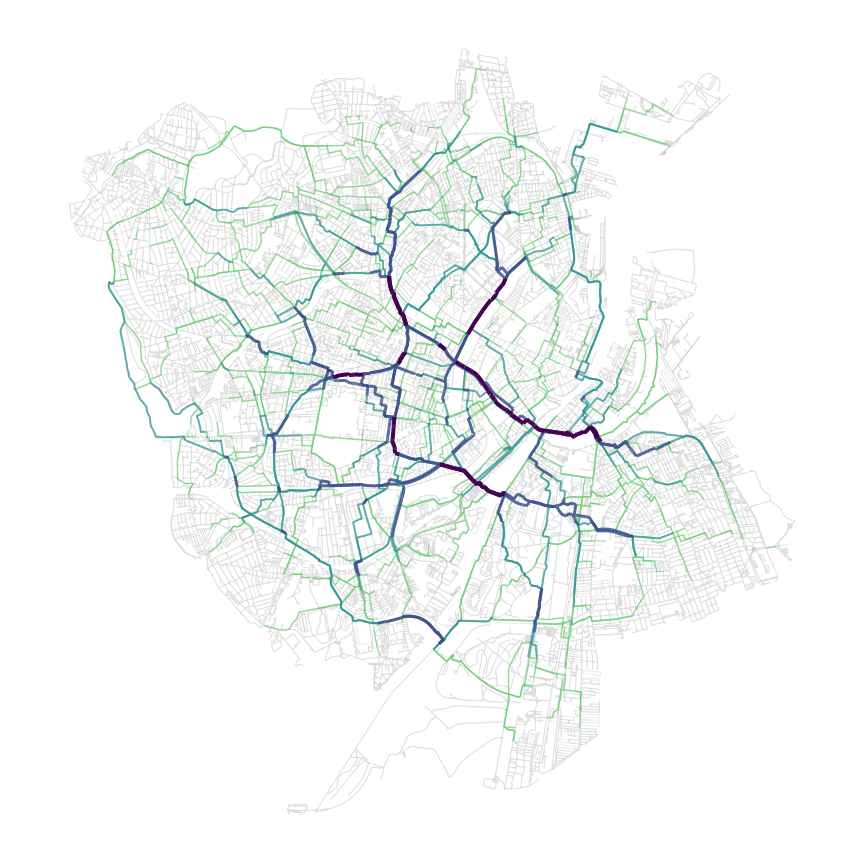

# Hyggebike 🚲
_Exam project for Geospatial Data Science - By Mads Høgenhaug, Marcus Friis &  Morten Pedersen_

Introducing ***Hygge*****bike**: A framework to get the _hyggeligste_ route from point A to point B. Based on various factors such as nearby birds, trees and noise, we compute a "hygge score" for each road. This hygge score used in the shortest path computation from A to B, such that we find the path with 🔥**maximum** ***hygge***🔥. 

</img>

## Overview
This repository contains and documents all steps in creating the _Hygge_bike pathfinder. There are 4 important notebooks that produce our results
- [`bird-edges.ipynb`](/notebooks/bird-edges.ipynb) --> [`bird_edges.csv`](/data/bird_edges.csv)
- [`tree-edges.ipynb`](/notebooks/tree-edges.ipynb) --> [`tree_edges.csv`](/data/tree_edges.csv)
- [`noise-edges.ipynb`](/notebooks/noise-edges.ipynb) --> [`noise_edges.csv`](/data/noise_edges.csv)
- [`hyggefinder.ipynb`](/notebooks/hyggefinder.ipynb) --> *Hygge*bike pathfinding algorithm 😎  

The first 3 notebooks wrangle and proces spatial data to produce edge level features, used for creating the algorithm. The last notebook, [`hyggefinder.ipynb`](/notebooks/hyggefinder.ipynb), produces the actual pathfinding algorithm and all other results. All notebooks are run using the _Docker Image_ `gds_py:8.0`.

## Data
We use various datasets for this project. All are briefly described here. 

### Bird observations
Bird observations originate from [DOFbasen](https://dofbasen.dk/search/index.php). It cotains an entry for each bird observation registered by users. We use bird observations in Copenhagen between 2020 and 2024.

### Trees
The tree data contains all municipal trees in Copenhagen municipality. It is downloaded from [Open Data DK](https://www.opendata.dk/city-of-copenhagen/trae-basis-kommunale-traeer#resource-traer_basis.csv). Due to it being for Copenhagen municipality, it does not have data for Frederiksberg.

### Noise
The noise data comes from Copenhagen municipality. It contains projected traffic noise for areas of Copenhagen, excluding Frederiksberg.  
Noise data for Copenhagen municipality only. It can be downloaded from [Opendata.dk](https://www.opendata.dk/city-of-copenhagen/vejstoej_2022). The data is displayed at [Copenhagen's Municipality's website](https://www.kk.dk/borger/affald-og-miljoe/stoej-stoev-og-luft/trafikstoej). 

</img>
